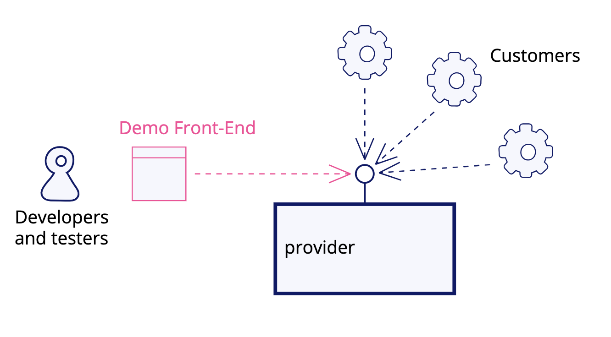
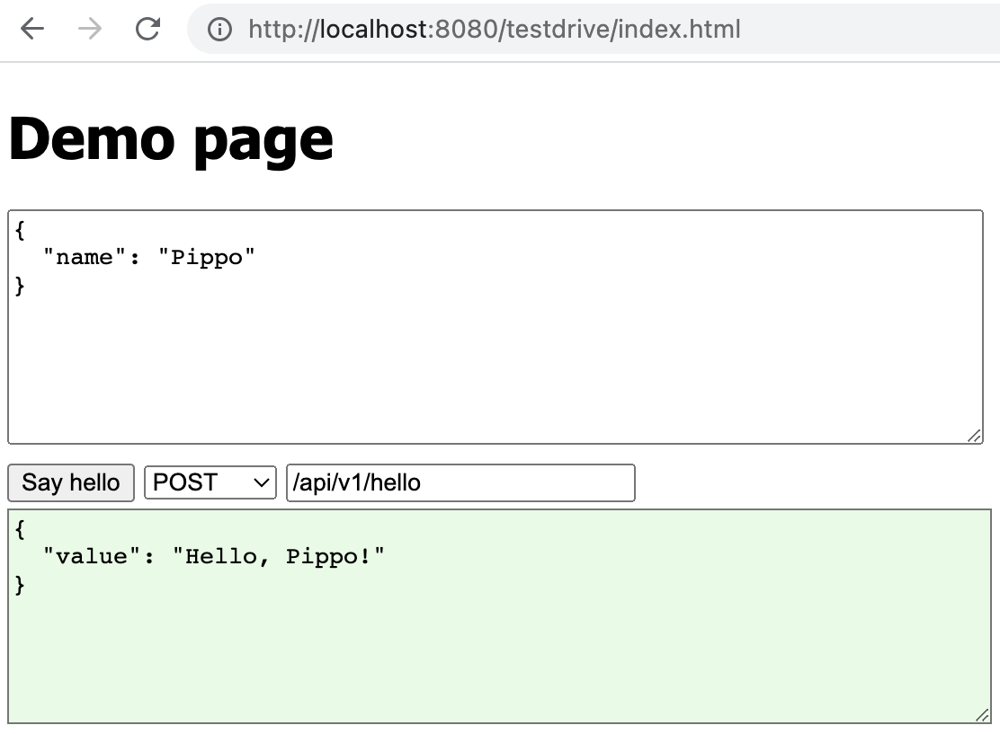
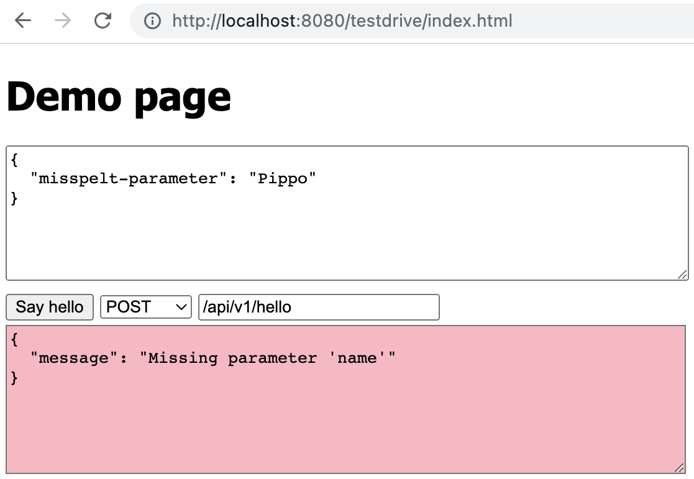
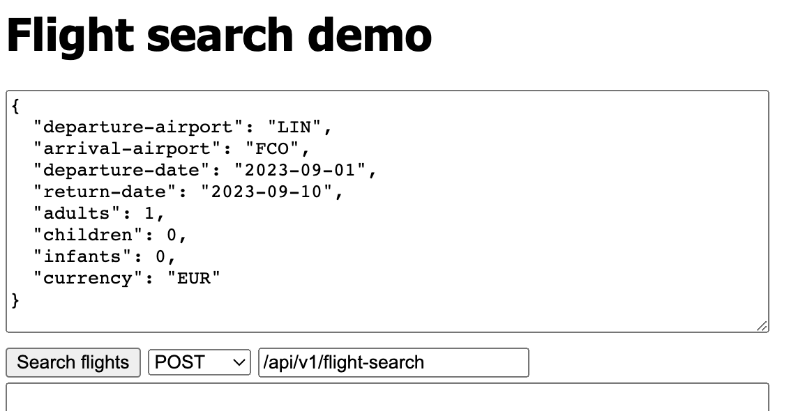
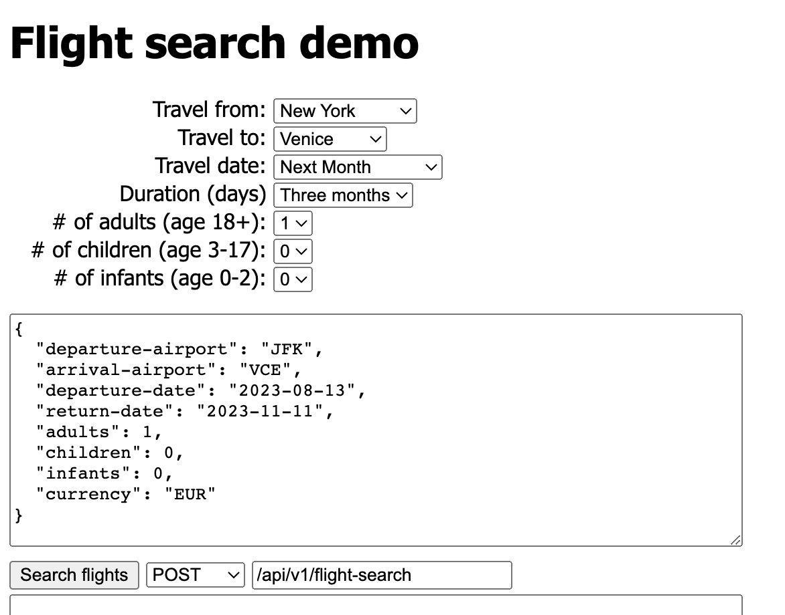
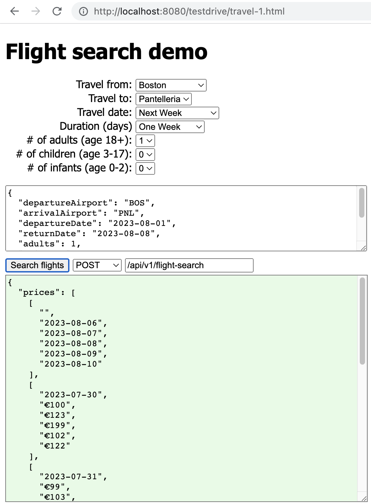
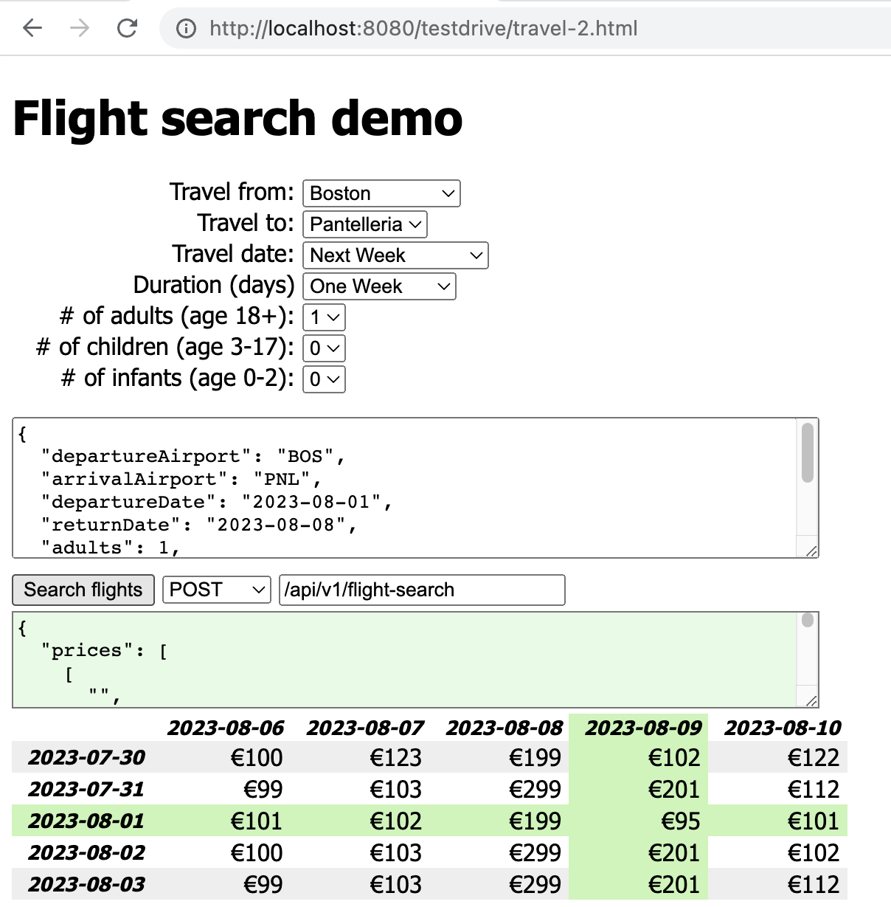

- 원문: [Demo Front-End](https://martinfowler.com/articles/demo-front-end.html)

### API를 테스트하고 탐색할 수 있는 프론트엔드 애플리케이션

사용자들은 혼란스럽고 산만해서 도무지 이해하지 못하고 있는데, 개발자들이 자랑스럽게 API 호출 결과 돌아온 JSON 출력 화면을 연달아 보여주는 “데모”에 참석해 본 적 있나요? 개발 과정에서 API를 사용하려다가 기능을 테스트할 수 있는 올바른 JSON 페이로드와 헤더 주문을 찾는 것이 어려워서 좌절해 본 적이 있나요? ‘데모 프론트엔드’는 이런 API를 시연하고 탐색할 수 있는 기본 기능을 제공하는 간단한 UI입니다.

### 동기

잘 작동하는 개발팀이 반드시 실천하는 것 중 하나는 개발 중인 제품의 최신 개선 사항에 대한 정기적인 데모를 개최하는 것입니다. 제품에 사용자 인터페이스가 있다면 데모는 주로 UI 자체를 통해 자연스럽게 제공되며, 회의에 참석한 이해관계자가 직접 테스트 할 수 있습니다.

하지만 제품이 API인 경우 어떨까요? 일반적으로 백엔드와 프론트엔드를 같은 팀에서 개발하는 것이 권장되는데, 두 개의 개별 팀이 조율해야 하는 상황보다 한 팀에서 개발하는 것이 더 높은 품질과 개발 시간 단축으로 이어지기 때문입니다. 하지만 이것이 불가능할 때도 있습니다. 백엔드(API)를 개발해서 해당 API로 제 3자에게 그 API를 통한 유용한 서비스 액세스를 판매하는 회사일 때 그렇습니다. 예를 들어, 이커머스 웹사이트가 고객으로부터 결제를 받을 수 있도록 '결제 게이트웨이(Payment Gateway)' API를 제공하는 금융 기관이나 가격 비교 엔진이 호출하는 API를 통해 가격 비교 엔진에 접속하는 서비스 제공업체가 있습니다.

API에 자연스러운 사용자 인터페이스가 없는 모든 경우에, 의미 있는 데모를 제공하기가 어렵습니다. 때로 팀에서 API에서 반환되는 JSON 코드를 보여줘서 API 사용 방법을 시연하려고 노력하지만, 이것은 비기술 기반의 이해관계자가 이해하기 어렵습니다. 또, 비즈니스 이해관계자가 제품을 집접 사용해보게 하는 것은 거의 불가능합니다.

> 💡 저는 이런 경우에 jQuery가 필요한 대부분의 요구 사항을 충족시킬 수 있기 때문에 가장 적합하다고 생각합니다. 유행하는 기술은 아니지만 강력하고 간결합니다. 현대적인 대안은 React(빌드 없는)이며, 현대적인 JavaScript는 라이브러리나 프레임워크 없이 직접 사용할 만큼 강력합니다.

이러한 상황에서 API 시연을 위해 명시적으로 개발된 간단한 UI를 개발하는 것이 유용합니다. UI는 화려하거나 특별히 멋져 보일 필요가 없으며, 전용 빌드를 설정할 필요도 없습니다. API 사용법을 쉽게 보여주기 위한 목적이면 됩니다.



이러한 데모 프론트엔드의 장점은 데모 중에 소프트웨어를 표시하는 데만 제한되지 않습니다. 일단 사용 가능한 게 생기면 개발자들이 코드를 리포지토리에 푸시하기 전에 로컬 머신에서 새로운 기능을 테스트하는 데 사용하며, QA, PO 및 기타 이해관계자들이 테스트 환경에서 제품을 테스트하는 데 사용할 수 있습니다. 또한 해당 API 구매에 관심이 있는 잠재적인 협력 업체에게 시연하기 위해 데모를 사용할 수도 있습니다. 데모 프론트엔드는 지속적으로 가치를 제공하는 선물입니다.

### 실용적인 조언

데모 프론트엔드는 관련 API를 사용할 수 있는 모든 부분에서 즉시 사용 가능할 때 가장 효과적으로 작동합니다. 예를 들어, Spring Boot 애플리케이션에서는 정적 HTML, CSS 및 JavaScript 에셋을 `src/main/resources/public/testdrive` 폴더에 배치해서 `https://localhost:8080/testdrive/`에서 브라우저를 열어 접근할 수 있도록 할 수 있습니다. 가장 간단한 데모 UI는 주로 Postman을 대체하는 역할이상을 수행하지 않습니다:

> 💡 만약 Spring Boot를 사용 중이라면 프로젝트에 devtools를 설치해서 서버를 다시 시작하지 않고도 데모 프론트엔드와 같은 정적 에셋에 대한 변경 사항을 테스트할 수 있도록 하세요.


*그림 2: 사용자는 요청 페이로드, 메서드 및 경로를 조정할 수 있습니다. 응답은 성공적인 응답을 나타내는 녹색으로 아래쪽 창에 표시됩니다.*


> 💡 이 스니펫은 정적 파일에서 jQuery를 사용해서 입력 텍스트 영역에 페이로드를 로드하는 방법을 보여줍니다. 웹 페이지를 새로고침할 때마다 실행됩니다:
>
> ```javascript
> $(document).ready(() => {
>   .get("test-data/hello.json", (data) => {})
>     ("#hello-input").val(data));
> });
> ```


*그림 3: 출력 텍스트 영역을 분홍색으로 표시하여 오류 응답을 더욱 명확하게 표시합니다.*

데모 UI는 주어진 API 엔드포인트에 대한 유효한 JSON 요청을 준비한 다음, 사용자가 테스트하려는 내용에 맞게 요청을 직접 수정할 수 있도록 하고, 사용자가 버튼을 누르면 응답을 표시합니다. 응답은 HTTP 상태 코드 및 관련 헤더와 함께 표시될 수 있습니다.

> 💡 서버 요청으로 API를 호출하는 코드:
> 
> ```javascript
> $(document).ready(() => {
>   $("#hello-button").click(sayHelloRequest);
> });
> 
> function sayHelloRequest() {
>   $("#hello-output").val("");
>   $("#hello-spinner").show()
>   $.ajax({
>     method: $("#hello-method").val(),
>     data: $("#hello-input").val(),
>     contentType: "application/json",
>     url: $("#hello-path").val(),
>     success: onSayHelloSuccess,
>     error: onSayHelloError,
>     complete: onSayHelloComplete,
>   });
> }
> 
> function onSayHelloSuccess(content) {
>   $("#hello-output").
>     removeClass("error").
>     addClass("success").
>     val(indent(content));
> }
> 
> function onSayHelloError(jq) {
>   const d = jq.responseJSON ?
>             jq.responseJSON : jq;
>   $("#hello-output").
>     removeClass("success").
>     addClass("error").
>     val(indent(d));
> }
> 
> function onSayHelloComplete() {
>   $("#hello-spinner").hide();
> }
> 
> function indent(json) {
>   return JSON.stringify(json, null, 2);
> }
> ```

현재 시점에서 여전히 JSON을 입력과 출력으로 모두 표시하고 있지만, Postman보다 상당한 이점이 있습니다. 사용자에게 제안된 입력 JSON의 정적 버전을 자동으로 보강하거나 수정할 수 있기 때문입니다. 예를 들어 유효한 요청에 고유 식별자가 포함되어야 한다면 사용자의 노력 없이 간단한 JavaScript 코드 스니펫을 사용해서 임의의 식별자를 생성할 수 있습니다. 중요한 것은 UI를 통해 문제를 최소화하면서 빠르게 테스트할 수 있다는 점입니다.

이런 데모 프론트엔드를 만드는 데 필요한 JavaScript는 미니멀합니다: 현재 JavaScript는 특정 라이브러리 없이도 충분히 강력하지만, 개발자는 htmx, jQuery 또는 인라인 React와 같은 가벼운 도구를 사용하는 것이 편리할 수 있습니다. 전용 빌드를 설정하면 API 실행과 UI를 통한 테스트 실행 사이에 추가 단계가 발생하기 때문에 전용 빌드를 설정하지 않는 것이 좋습니다. 이상적으로는 API 제품 자체의 빌드만 실행하는 것이 좋습니다. 무언가를 테스트하고 싶을 때와 실제로 테스트를 실행하는 순간 사이에 지연이 발생하면 개발 루프가 느려집니다.

이러한 UI의 자연스러운 진화는 다음과 같습니다.

1. 다양한 유형의 입력을 생성하는 기능을 추가하고, JSON 텍스트 영역을 적절한 HTML 양식으로 완전히 대체할 수도 있습니다.
2. 이해하기 쉬운 방식으로 API 호출 결과를 파싱하고 표시합니다.

예를 들어, 여행 날짜가 아직 유동적인 여행자를 위한 최적의 상품을 찾는 것을 목적으로 항공편을 예약할 수 있는 여행 관련 API가 있다고 가정해 보겠습니다. 검색을 수행하고 가격 조합 목록을 반환하는 초기 API가 있을 수 있습니다. 입력 JSON은 다음과 같을 수 있습니다

```json
{
  "departure-airport": "LIN",
  "arrival-airport"  : "FCO",
  "departure-date"   : "2023-09-01",
  "return-date"      : "2023-09-10",
  "adults"           : 1,
  "children"         : 0,
  "infants"          : 0,
  "currency"         : "EUR"
}
```

우리의 데모 UI는 입력 텍스트 영역에 샘플 페이로드를 로드하기 때문에 사용자가 정확한 구문을 기억할 필요가 없습니다.


*그림 4: 실제 JSON 페이로드는 복잡한 경향이 있습니다.*

그러나 사용자가 날짜를 변경해야 할 수도 있습니다. 고정된 출발 또는 도착 날짜는 시간이 지남에 따라 결국 유효하지 않습니다. 날짜를 변경하는 데 시간이 걸리며 수동 오류로 인해 추가 시간 손실이 발생할 수 있기 때문입니다. 한 가지 해결책은 JSON의 날짜를 자동으로 수정하여 예를 들어 미래 30일로 설정하는 것입니다. 이렇게 하면 API의 빠른 "스모크 테스트"를 매우 쉽게 수행할 수 있습니다. "항공편 검색"을 클릭하고 결과를 확인하기만 하면 됩니다.

한 단계 더 나아갈 수 있습니다. 예를 들어, 때로는 약 6개월 후의 항공편 가격을 확인하고 싶을 수 있고, 3개월 후나 1주일 전의 항공편 가격을 확인하고 싶을 수도 있습니다. 사용자가 드롭다운 메뉴를 선택해서 JSON 페이로드를 빠르게 변경할 수 있는 UI를 제공하는 것은 멋진 아이디어입니다. 다른 입력 필드(예: 공항 코드)에 대해서도 동일한 기능을 제공하면 사용자가 공항 코드를 찾아보는 필요가 없어지므로 소중한 시간을 절약할 수 있습니다.

> 💡 드롭다운 메뉴가 변경될 때마다 입력 페이로드의 일부를 업데이트하기:
> 
> ```javascript
> $(document).ready(() => {
>   $("#departure-airport").
>     change(updateDepartureAirport);
> });
> 
> function updateDepartureAirport() {
>   const searchInput =
>     JSON.parse($("#search-input").val());
>   searchInput.departureAirport =
>     $("#departure-airport").val();
>   $("#search-input").val(indent(searchInput));
> }
> ```


*그림 5: 페이로드를 자동으로 조정하기 위한 HTML 양식 추가*

위의 UI를 사용하면 사용자가 전문 지식이 거의 없어도 빠르고 쉽게 JSON 페이로드를 변경할 수 있습니다. 생성된 JSON을 검사할 수 있으며, HTML 양식에 포함되지 않는 경우를 테스트하려는 경우 사용자가 직접 변경할 수 있습니다.

항공편 검색 API는 고객이 출발 항공편과 귀국 항공편의 최적의 조합을 선택할 수 있도록 날짜별로 다양한 가격의 매트릭스를 반환할 수 있습니다. 예를 들면 다음과 같습니다:


*그림 6: JSON 응답도 복잡한 경향이 있습니다.*

> 💡 이 테이블과 같은 복잡한 UI는 [ejs](https://ejs.co/)와 같은 템플릿 라이브러리를 통해 더 쉽게 만들 수 있습니다.
> 
> ```html
> <script id="table-template"
>         type="text/x-ejs-template">
>   <table class="striped">
>     <tr>
>       <% for (let col=0;
>               col< response.prices.length; col++) {
>       %>
>       <th><%= response.prices[0][col] %></th>
>       <% } %>
>     </tr>
>     <% for (let row=1;
>             row< response.prices.length; row++) {
>     %>
>     <tr>
>       <th><%= response.prices[row][0] %></th>
>       <% for (let col=1;
>               col< response.prices.length; col++) {
>       %>
>       <td><%= response.prices[row][col] %></td>
>       <% } %>
>     </tr>
>     <% } %>
>   </table>
> </script>
> 
> ```
> 
> ```javascript
> function onSearchSuccess(content, textStatus, jq) {
>   $("#search-output").removeClass("error").
>     addClass("success").val(indent(content));
>   buildPriceTable();
> }
> 
> function buildPriceTable() {
>   const source = $("#table-template").text();
>   const template = ejs.compile(source);
>   try {
>     const responseText = $("#search-output").val();
>     const response = JSON.parse(responseText);
>     const htmlTable = template({response: response});
>     $("#search-output-table").html(htmlTable);
>   } catch (exception) {
>     console.log(exception);
>     $("#search-output-table").html("");
>   }
> }
> ```

사람이 JSON으로 된 가격 정보 매트릭스를 이해하기는 어렵기 때문에 JSON을 파싱하여 멋진 HTML 테이블로 형식을 지정할 수 있습니다.


*그림 7: 응답을 구문 분석하고 읽기 쉬운 형식으로 표시합니다.*

간단한 HTML 테이블을 사용하면 기술 및 비기술 사용자가 API 결과를 쉽게 확인하는데 도움이 됩니다

### 자주 묻는 질문

#### Swagger UI를 사용하지 않는 이유는 무엇인가요?

Swagger UI는 즉시 사용할 수 있고, 소스 코드와 동일한 소스 코드 저장소에 정의되어 있으며, API를 제공하는 동일한 서비스에서 제공된다는 점에서 데모 프론트 엔드와 동일한 장점을 가지고 있습니다. 데모 프론트엔드에 비해 몇 가지 단점이 있습니다:

- Swagger UI의 입력 및 출력 페이로드는 JSON으로 제한되어 있어 가독성을 높일 수 없습니다.
- 기술 전문가가 아닌 사용자에게는 친숙하지 않습니다.
- 정적 페이로드만 제공할 수 있는데, 호출할 때마다 임의의 ID를 제공해야 한다면 어떻게 해야 할까요? 페이로드에 현재 날짜가 포함되어야 한다면 어떻게 해야 할까요? 사용자는 페이로드를 직접 수정해야 하고, 수정 방법을 알아야 합니다. 약간의 자바스크립트만 있으면 데모 프론트엔드에서 이 기능을 쉽게 자동으로 제공할 수 있습니다.
- Swagger UI는 워크플로를 지원하지 않지만 데모 프론트엔드를 사용하면 호출해야 할 호출을 적절한 순서로 제시하여 사용자를 안내할 수 있습니다. 또한 한 호출의 출력에서 일부를 가져와 워크플로우에서 다음 호출을 위한 페이로드를 준비하는 데 사용할 수도 있습니다.

#### npm으로 전용 빌드를 설정해야 하나요?

프론트엔드에서 전용 빌드 명령을 사용하는 경우 로컬 편집-컴파일-실행-테스트 루프에 추가 단계가 생기므로 루프 속도가 느려집니다. 또한 지속적 통합 및 배포 자동화가 복잡해집니다. 이제 소스 코드 저장소에 하나가 아닌 두 개의 아티팩트가 생성되므로 둘 다 빌드하고 둘 다 배포해야 합니다. 이러한 이유로 저는 이 방법을 권장하지 않습니다. Angular와 같은 "큰" 프론트엔드 프레임워크에 익숙하다면 인라인 `<script>` 태그에 jQuery 또는 React를 로드하는 것만으로 얼마나 많은 작업을 수행할 수 있는지 놀라실 것입니다.

#### 고객이 요청하지 않은 작업을 하는 건 아닌가요?

데모 프론트엔드는 제품의 테스트 가능성, 개발자 경험, 개발 속도 등 클라이언트가 좋아할 만한 제품의 일부 교차 기능적 속성을 개선하지만, 유용하게 영향을 받을 수 있는 다른 교차 기능적 속성도 있습니다.

한 가지 예를 들어드리자면, 얼마 전 저희는 API 제품을 다시 작성하는 작업에 참여했습니다. 이 제품에서 API 호출은 다른 다운스트림 서비스에 대한 수십 개의 호출로 이어질 수 있으며, 이러한 각 다운스트림 호출은 HTTP 오류 상태 코드를 반환하여 HTTP 의미에서 실패할 수도 있고 응답 페이로드에 논리적 오류 코드를 반환하여 논리적으로 실패할 수도 있습니다. 수십 개의 다운스트림 호출 중 하나라도 다른 방식으로 실패하면 API 응답에 예상치 못한 다른 결과가 나타날 수 있으므로 시스템이 다운스트림 서비스와 상호 작용할 때 어떤 일이 발생하는지 빠르게 확인할 수 있는 방법이 필요했습니다. 그래서 데모 프론트엔드에 모든 다운스트림 서비스 상호 작용에 대한 보고서를 추가하여 API 호출에 대한 응답으로 각 다운스트림 호출의 요청과 응답을 표시하는 기능을 개선했습니다.

데모 프론트엔드는 결국 테스터가 통화에서 예상한 결과가 나오지 않는 이유를 쉽게 디버깅할 수 있게 해주어 제품의 성공에 크게 기여한 킬러 기능이 되었습니다. 결국 데모 프론트엔드는 프로덕션 환경에서도 사용할 수 있게 되어 내부 사용자가 제품 클라이언트, 즉 파트너로부터 걸려오는 통화의 문제를 해결할 수 있게 되었습니다. 고객은 이전 시스템에서는 통화가 예상대로 작동하지 않는 이유를 며칠이 걸렸던 것에 비해 이제는 몇 분 만에 해결할 수 있어서 만족스럽다고 말했습니다.

고객이 명시적으로 데모 프론트엔드를 요청하지는 않았지만, 프로젝트 시작 단계에서 현재 시스템으로는 API에 대한 일부 호출이 예상치 못한 값을 반환하는 이유를 해결하는 것이 얼마나 어려웠는지 이야기한 적이 있었습니다. 우리가 구축한 데모 프론트엔드는 무엇보다도 그들이 말했던 문제에 대한 해결책이었습니다.

#### 더 나아가기

API 엔드포인트는 자동화된 워크플로우를 지원하거나 인간 사용자의 의사 결정 프로세스를 지원하기 위해 연속적으로 사용되어야 하는 경우가 많습니다.이러한 경우 데모 프론트엔드를 확장하여 워크플로우를 명시적으로 지원할 수 있습니다. 어떤 의미에서 데모 프론트엔드는 API 사용 방법에 대한 API 사용자를 위한 문서로 사용하거나 전체 구현을 위한 예제로 삼을 수 있는 프로토타입 프론트엔드로 사용할 수 있습니다.

이 [git 저장소](https://github.com/xpmatteo/demo-frontends-for-api-only-products-demo)에는 시작점으로 사용할 수 있는 몇 가지 샘플 코드가 있으며, 스크린샷은 여기에서 가져온 것입니다.

---

번역에 수정이 필요한 부분이 있다면 [메일](/about)로 알려주시면 감사하겠습니다!